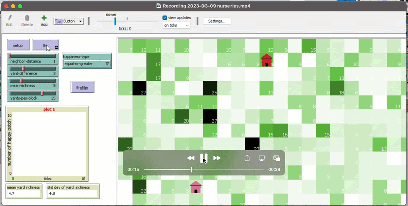

# Spatial Mimicry and Front Yard Management in Chicago

## Overview

This project explores how neighbor interactions influence front yard management decisions across residential neighborhoods in Chicago. The research focuses on whether homeowners mimic one another in their landscaping behaviors and whether these interactions create measurable spatial patterns.

## Motivation

Human behavior and social interactions often shape how neighborhoods visually evolve over time. This project was designed to better understand whether nearby residents influence each other’s landscaping choices, including planting behavior and yard management decisions.

## Data Collection

The dataset included information collected from more than 800 residential yards across Chicago neighborhoods. The project incorporated:

- Human behavior variables
- Spatial neighborhood data
- Plant species data
- Yard characteristics

The resulting simulations generated hundreds of thousands of lines of output data that required extensive processing and spatial analysis.

## Methods

This project combined agent-based modeling with spatial statistical analyses to evaluate mimicry patterns among neighbors.

Spatial autocorrelation analyses included:

- Local Moran’s I
- Global Moran’s I

These methods helped identify whether clusters of similar yard behaviors occurred across neighborhoods.

## Computational Challenges

The project involved large scale simulation outputs that were computationally intensive. To improve performance, analyses were restructured into batch calculations and executed within a Linux environment with upgraded memory resources.

## Goals

The goal of this research is to better understand how social interactions contribute to spatial patterns within urban residential landscapes and how these processes influence neighborhood level ecological systems.

## Tools Used

- R
- Agent-Based Modeling
- Moran’s I
- Spatial Statistics
- Linux
- Parallel Computing
- Simulation Modeling

## Spatial Visualization

### Moran's I Cluster Analysis

This visualization summarizes the spatial autocorrelation patterns identified in the yard management model under different neighborhood comparison scenarios. The color gradient represents Global Moran’s I values, where warmer colors indicate stronger spatial clustering or mimicry among neighboring yards. Significant spatial patterns were primarily observed when nearby neighbors had similar yard characteristics, while more random or dissimilar yard conditions showed weaker spatial autocorrelation. These results suggest that localized neighbor interactions play an important role in shaping spatial patterns across residential landscapes.

### Neighborhood Spatial Patterns

This visualization shows how spatial similarity between neighboring residential yards changes as the distance between yards increases. Moran’s I values closer to 1 indicate stronger spatial autocorrelation, meaning nearby neighbors are more likely to have similar yard characteristics or behaviors. The results show that mimicry patterns are strongest among nearby neighbors and gradually decrease as yard distance increases. Different neighbor distance scenarios were analyzed to evaluate how localized social interactions influence spatial patterns across residential landscapes in Chicago.

## Simulation Visualization

This simulation demonstrates how neighboring households interact within the agent-based model and how localized decisions contribute to emerging spatial patterns across residential landscapes.
